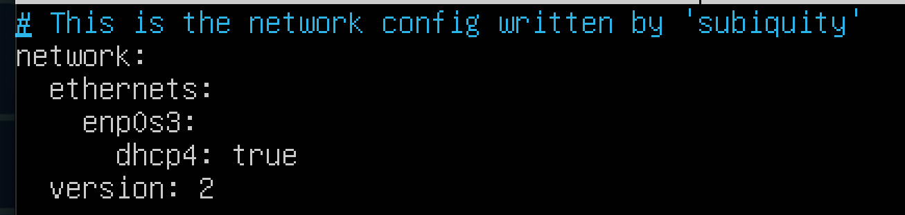
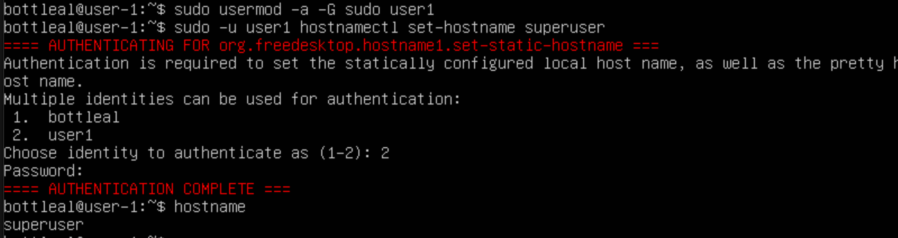
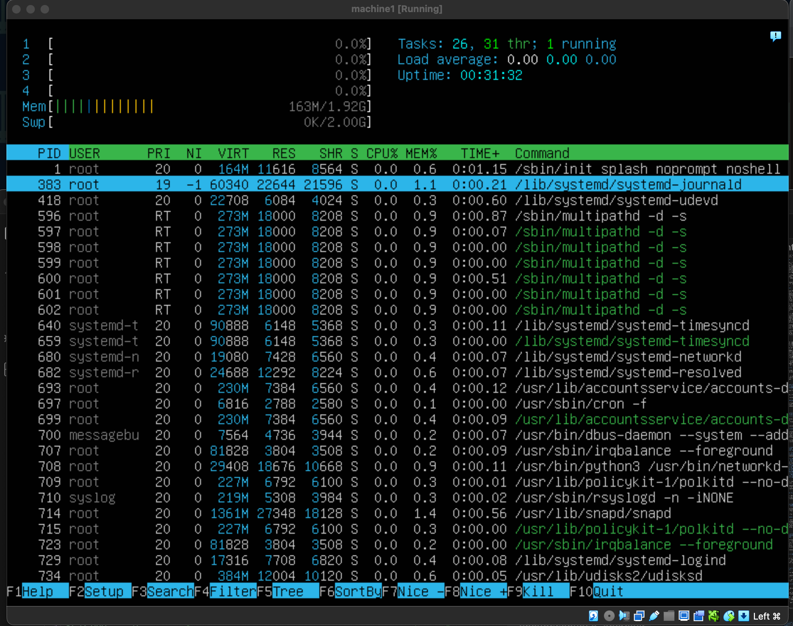
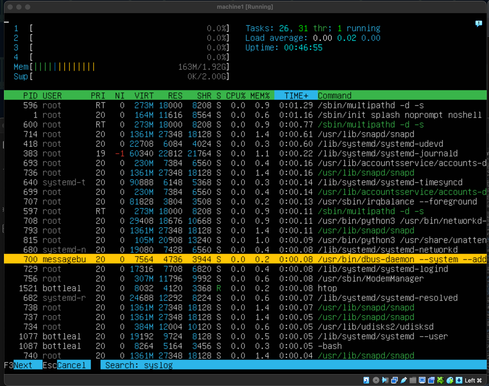
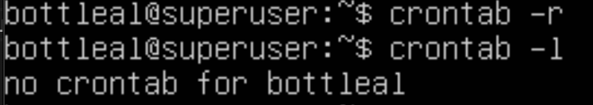

## Part 1. Установка ОС  

Установи Ubuntu 20.04 Server LTS без графического интерфейса.  

Узнай версию Ubuntu, выполнив команду `cat /etc/issue`  

  

## Part 2. Создание пользователя  

Создай пользователя, отличного от созданного при установке. Пользователь должен быть добавлен в группу adm.  

  
  

## Part 3. Настройка сети ОС  

Задаю название машины вида user-1 с помощью команды:
`sudo hostnamectl set-hostname user-1`

  
   

Устанавливаю временную зону, соответствующую моему текущему местоположению с помощью команды: 
`sudo timedatectl set-timezone Europe/Moscow`.  

  
 

Вывожу названия сетевых интерфейсов с помощью консольной команды   
 

Интерфейс lo (loopback device) — это виртуальный сетевой интерфейс, который используется для внутренней коммуникации внутри одного и того же устройства. Он позволяет программам и процессам на одном компьютере обмениваться данными друг с другом, не используя физическую сеть. Обычно имеет IP-адрес 127.0.0.1, этот адрес также известен как localhost.

Используя консольную команду, получаю ip адрес устройства, на котором работаю, от DHCP сервера с помощью команды `ip route show`

DHCP (Dynamic Host Configuration Protocol) — это протокол, который автоматически назначает IP-адреса и другие сетевые параметры устройствам в сети. Он назначает уникальные IP-адреса клиентам, что предотвращает конфликты IP-адресов, предоставляет маску подсети, которая определяет диапазон IP-адресов в сети, предоставляет IP-адрес шлюза по умолчанию, который используется для маршрутизации трафика вне локальной сети, IP-адреса DNS-серверов, которые используются для разрешения доменных имен, может предоставлять дополнительные параметры, такие как время жизни аренды IP-адреса, серверы времени и другие.

Определяю и вывожу на экран внешний ip-адрес шлюза (ip)с помощью команды:  
`wget -O - -q icanhazip.com`  

  

и внутренний IP-адрес шлюза, он же ip-адрес по умолчанию (gw):  

   

Задаю статичные настройки ip, gw, dns, используя публичные DNS серверы, захожу в nano, чтобы увидеть содержимое YAML:  

     

Изменила:  
   

Перезагрузила виртуальную машину, всё соответствует.

   

Успешно пропинговала удаленные хосты 1.1.1.1 и ya.ru. В выводе - «0% packet loss».

 

## Part 4. Обновление ОС  
Обновляю систему с помощью `sudo apt update` и `sudo apt upgrade`

   

    
Повторяю команду и получаю вывод, что новых пакетов и обновлений не обнаружено:  
   

## Part 5. Использование команды **sudo**  

Даю пользователю права администратора с помощью команды `sudo usermod -aG sudo username`   

     

sudo — это команда в Linux, которая позволяет обычным пользователям выполнять команды с правами суперпользователя/администратора (root). Суперпользователь имеет полный доступ к системе и может делать все, что угодно, включая изменение важных настроек и установку программ.

Меняю hostname от имени пользователя user1 с помощью команды sudo -u <old_name> hastnamectl set-hostname <new_name>  

  

## Part 6. Установка и настройка службы времени    

Вывожу время часового пояса, в выводе содержится `NTPSynchronized=yes`: \
`timedatectl show`    

     

## Part 7. Установка и использование текстовых редакторов   

Используемые редакторы: **VIM**, **NANO**, **JOE**    

Создаю и открываю test_vim.txt, в vim пишу свой никнейм и выхожу, сохраняя изменения с помощью esc :wq enter    

   

Создаю и открываю test_nano.txt, в nano пишу свой никнейм и выхожу, сохраняя изменения с помощью  Control + x y (yes) 

   

Cкачиваю редактор joe с помощью команды sudo apt install joe. Создаю и открываю test_joe.txt, в joe пишу свой никнейм и выхожу, сохраняя изменения с помощью  Control + k, Control + x  

   

vim  
Для выхода без изменений esc + : + q!  

   

nano
Для выхода без изменений Control + x n (no)   

   

joe    
Для выхода без изменений Control + K + X  

 

Используя каждый из трех выбранных редакторов, редактирую файл ещё раз (по аналогии с предыдущим пунктом), а затем использую функции поиска по содержимому файла (слово) и замены слова на любое другое.

vim    
Для поиска и/или замены вводим команду `:s/word_to_find/word_to_replace`  

  

nano   
Поиск слова control + w   

   

Замена слова  control + \

joe    

Поиск слова control + k, control + f  

    

Замена слова control + k, control + r, y (yes)  

  
   

## Part 8. Установка и базовая настройка сервиса **SSHD**    

Устанавливаем SSH c помощью команды `sudo apt-get install ssh`    

     

Устанавливаем OpenSSH `sudo apt install openssh-server`

   

Проверка изменений с помощью команды `sudo systemctl status sshd`  

   

Добавляю автостарт службы при загрузке системы `sudo systemctl enable ssh`    

   

Перенастраиваю службу SSHd на порт 2022  

    
   

Использую команду ps, показываю наличие процесса sshd. Для этого к команде подюираю ключи  

   

ps aux - команда ps aux показывает список всех процессов, запущенных в системе, включая информацию о пользователе, времени запуска и других параметрах.  

a — показывает процессы всех пользователей.    

u — показывает подробную информацию о процессах, включая пользователя, который запустил процесс, и время запуска.    

x — показывает процессы, которые не связаны с терминалом.    

| (pipe) - это символ, который используется для передачи вывода одной команды в качестве ввода другой команды.  

grep — это команда, которая ищет строки, содержащие определенный текст.  

sshd — это текст, который мы ищем. В данном случае, это имя процесса SSH.   

Перезагружаю систему `sudo reboot`  

  

Устанавливаем netstat `sudo apt install net-tools`    

    

Вывод команды netstat -tan должен содержать  \
`tcp 0 0 0.0.0.0:2022 0.0.0.0:* LISTEN`  

   

Команда netstat -tan используется для отображения информации о сетевых соединениях и портах в системе Linux, она показывает все активные и ожидающие TCP-соединения в системе, используя числовые IP-адреса и номера портов.    
netstat - это утилита командной строки, которая предоставляет информацию о сетевых соединениях, маршрутизации, интерфейсах и статистике сети.    
-t этот флаг означает, что команда должна показывать только TCP-соединения.  
-a этот флаг означает, что команда должна показывать все соединения и ожидающие порты (listening ports).  
-n этот флаг означает, что команда должна показывать числовые IP-адреса и номера портов вместо имен хостов и сервисов.      

0.0.0.0 в foreign address - означает что никто не подключен.  
0.0.0.0 в local address - означает listening on all interfaces.  
Если в качестве адреса отображается 0.0.0.0 , то это означает в соединении могут использоваться все IP-адреса существующие на данном компьютере.  
Recv-Q - количество байт, не прочитанных приложением.  
Send-Q -количество байт, не отправленных сетью.   
State - состояние соединения (например, LISTEN, ESTABLISHED).    

## Part 9. Установка и использование утилит **top**, **htop**  

Устанавливаю и запускаю утилит **htop** с помощью `sudo apt install htop`, пакет  **top** заранее предусмотрен  

  

Вывод команды top  

   

 - uptime   
    16 min  
  - количество авторизованных пользователей   
    1 user  
  - общую загрузку системы  
    0.01    
  - общее количество процессов  
    122  
  - загрузку cpu  
    0  
  - загрузку памяти  
    1970.9 total, 1429.0 free, 162.6 used  
  - pid процесса занимающего больше всего памяти  
    1 root
  - pid процесса, занимающего больше всего процессорного времени  
    1487 root, 1488 bottleal
- В отчёт вставь скрин с выводом команды htop:  

  - отсортированному по PID, PERCENT_CPU, PERCENT_MEM, TIME  

PID  
  

PERCENT_CPU  
     

PERCENT_MEM  
   

TIME  
   

  - отфильтрованному для процесса sshd (f4 sshd)  

  

  - с процессом syslog, найденным, используя поиск   

   

  - с добавленным выводом hostname, clock и uptime  

   

## Part 10. Использование утилиты **fdisk**  

Запускаю команду fdisk -l  

  

название жесткого диска - /dev/sda  

его размер - 25 GiB  

количество секторов - 52428800  

для того,чтобы узнать размер swap отдельно используем команду `swapon`  

   
размер swap - 2G  

## Part 11. Использование утилиты **df**   
Запусти команду df  
   

В отчёте напиши для корневого раздела (/):
размер раздела - 11758760 блоков по 1 килобайту
размер занятого пространства - 4843628
размер свободного пространства - 6296024
процент использования - 44%
Определили единицу измерения в выводе - килобайт   

Запусти команду df -Th  
 

размер раздела - 12G
размер занятого пространства - 4,7G
размер свободного пространства - 6,1G
процент использования - 44%
тип файловой системы для раздела - ext4  

## Part 12. Использование утилиты **du**  
запустили команду du  
  

Выведи размер папок /home, /var, /var/log в байтах, в человекочитаемом виде  

   

Выведи размер всего содержимого в /var/log (не общее, а каждого вложенного элемента, используя *)  

  

## Part 13. Установка и использование утилиты **ncdu**  
Установи утилиту ncdu  
   
Выведи размер папок /home, /var, /var/log  

/home    
   

/var  
   

/var/log   
  

## Part 14. Работа с системными журналами  

 Открой для просмотра:  
 1. /var/log/dmesg  
 

 2. /var/log/syslog  
 

 3. /var/log/auth.log   
 

- Напиши в отчёте время последней успешной авторизации, имя пользователя и метод входа в систему  
 
Время последней авторизации - 09/05/2024 20:04:45  

Имя пользоватля - bottleal  

Метод входа в систему - tty1  

- Перезапусти службу SSHd;  
  

- Вставь в отчёт скрин с сообщением о рестарте службы (искать в логах).  

   

## Part 15. Использование планировщика заданий **CRON**  

Используя планировщик заданий, запусти команду uptime через каждые 2 минуты.    
зашла через команду crontab -e   
   

- - Нашли в системных журналах строчки (минимум две в заданном временном диапазоне) о выполнении (командой journalctl | grep "CRON")    
 

- Вывела на экран список текущих заданий для CRON  командой crontab -l

   

Удали все задания из планировщика заданий.
- В отчёт вставь скрин со списком текущих заданий для CRON.  

    